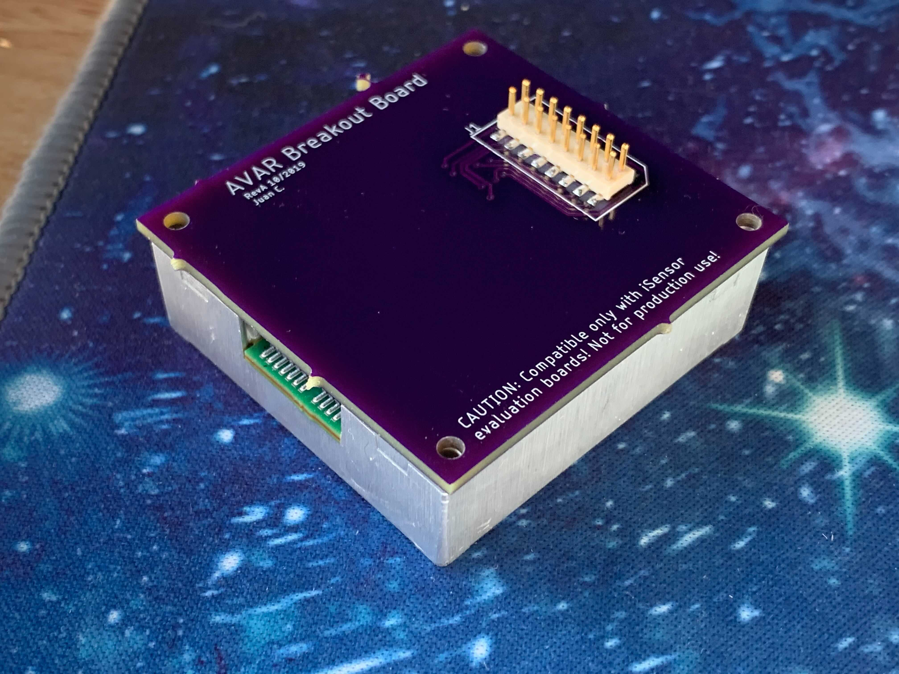
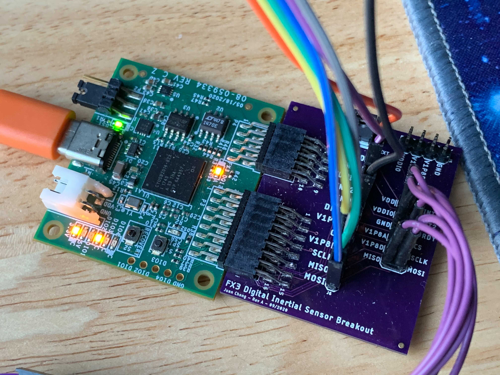
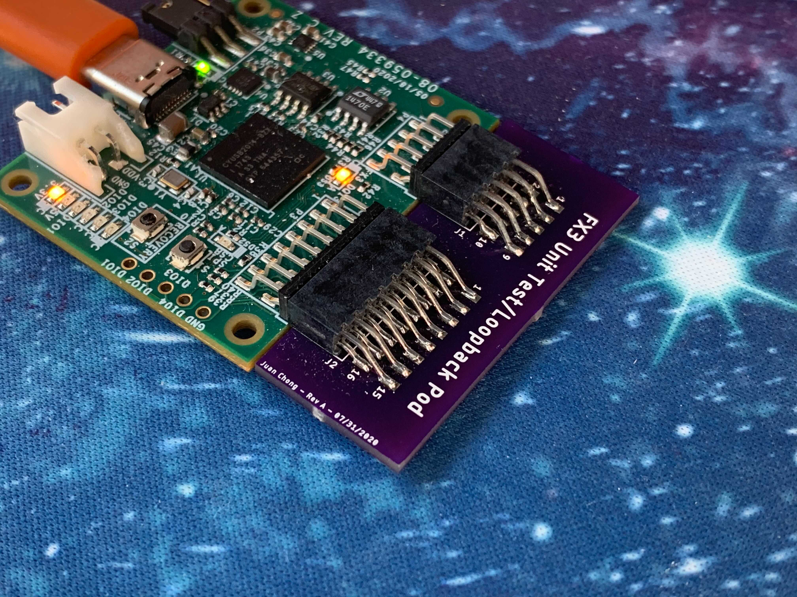

# iSensor IMU Expansion Boards
## Introduction

This repository contains several expansion boards, FX3 pods, and miscellaneous circuit boards I've designed over the years to interface with ADI iSensor IMUs. All of these designs were validated at some point, but regardless, may have small issues (usually mechanical alignment)! 

### 48x, 49x Breakout Board

This board was designed as a smaller, more space-efficient replacement for the ADIS16IMU1/PCBZ board and provides similar functionality. All of the necessary signals are routed from the 24-pin, 1mm connector to the 16-pin, 2mm connector. 

A copy of the <u>Rev C</u> version of this PCB can be ordered from OshPark using this [link](https://oshpark.com/shared_projects/d1aorWWM).

### ADXL_ADXRS Breakout Pod

This board was designed to interface with the EVAL-ADIS-FX3 (hence the "pod" nickname) and provides a generic interface for ADI accelerometers (ADXL-series devices) and gyroscopes (ADXRS-series devices) with a **digital** interface. 

A copy of the <u>Rev A</u> version of this PCB can be ordered from OshPark using this [link](https://oshpark.com/shared_projects/PcQ047B9).

### FX3 Unit Test Loopback Pod

This board provides a compact and convenient way of verifying that the EVAL-ADIS-FX3 was manufactured correctly by looping back GPIO pins to each other. [This](https://github.com/juchong/EVAL-ADIS-FX3-Production-Test) repository contains additional software and documentation resources. 

A copy of the <u>Rev B</u> version of this PCB can be ordered from OshPark using this [link](https://oshpark.com/shared_projects/FAYf9S82).

